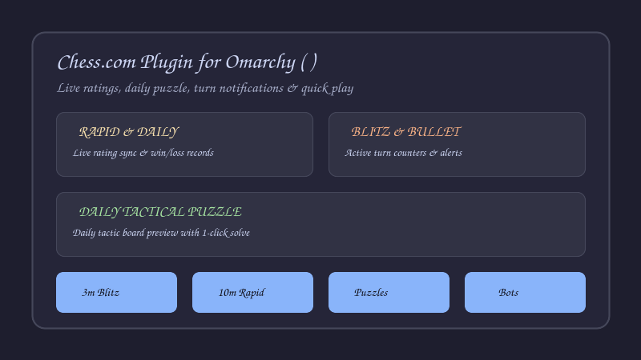

# Omarchy Chess.com Plugin (♟)

A fast, responsive Chess.com status bar widget and pop-out panel for [Omarchy Linux](https://omarchy.org/).



---

## ✨ Features

- **♟ Turn-to-Move Badge:** Lights up in your theme accent color and counts pending moves so you never miss a turn in your daily correspondence games.
- **⏳ Active Games Tracker:** Displays all ongoing matches with color, opponent name, time countdown, and 1-click jump to move.
- **⚡ Live Rating Cards:** Displays current ratings and Win/Loss/Draw records for:
  - ⏱ **Rapid** (10 min)
  - 📅 **Daily**
  - ⚡ **Blitz** (3 min / 5 min)
  - 🧩 **Puzzles & Tactics**
- **🧩 Daily Tactical Puzzle:** Fetches and renders today's Chess.com daily puzzle with mini-board preview. Click to solve.
- **⚡ Instant Game Launchers:** 1-click buttons to launch:
  - `⚡ 3 min Blitz`
  - `⏱ 10 min Rapid`
  - `🧩 Tactics & Puzzles`
  - `🤖 Play vs Computer Bots`
- **👤 Player Profile Card:** Displays your Chess.com avatar, username, grandmaster/master title pill, and real name.
- **🔍 Inline Username Switcher:** Type any Chess.com username directly inside the panel to inspect stats for yourself, friends, or grandmasters like `hikaru` and `magnuscarlsen`.
- **🎨 Native Theme Adaptive:** Respects Omarchy light/dark themes, accent colors, and corner radius tokens.
- **🚀 Web App Integration:** Right-click the bar icon to launch the full standalone Chess.com web app immediately.

---

## 📦 Installation

Install and enable with a single command:

```bash
omarchy plugin add https://github.com/jasonpatel/omarchy-chessdotcom --enable
```

Or clone manually:

```bash
git clone https://github.com/jasonpatel/omarchy-chessdotcom.git ~/.config/omarchy/plugins/jason.chess
omarchy-shell shell rescanPlugins
```

---

## ⚙️ Configuration Options

| Key | Type | Default | Description |
| :--- | :--- | :--- | :--- |
| `username` | `string` | `""` | Your Chess.com username. |
| `panelWidth` | `integer` | `390` | Pop-out panel width in shell units (320–600). |
| `showPuzzle` | `boolean` | `true` | Show the Daily Puzzle preview banner. |
| `pollMinutes` | `integer` | `2` | Background rating and turn poll interval in minutes. |

---

## 🤝 Status & Contributing

This plugin is **stable, feature-complete, and ready for daily use**.

Contributions, feature suggestions, and bug reports are welcome!
- **Feature Requests & Bugs:** Open an issue on GitHub.
- **Pull Requests (PRs):** Contributions and enhancements are welcome.

---

## 📜 License

MIT License. Copyright (c) 2026 Jason.
